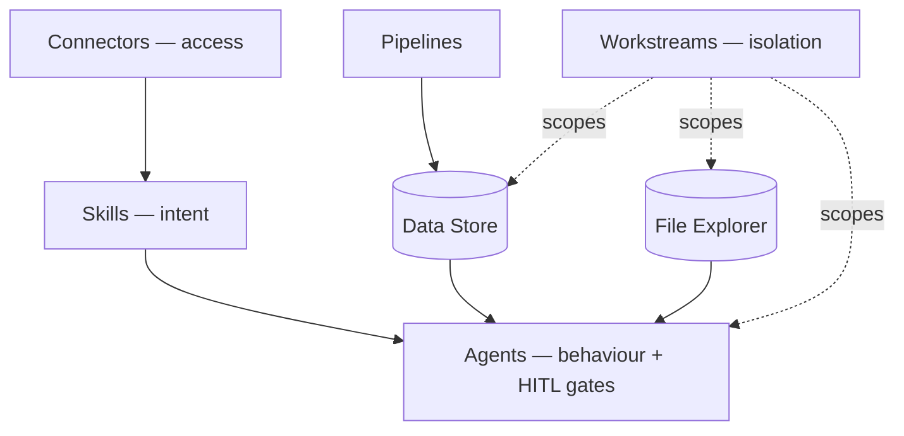

Before diving into any single feature, it's worth seeing how the whole thing fits together. Adopt AI is a layered agent platform: each layer builds on the one beneath it, and the layers group into two tracks that do very different jobs.

## A Layered Platform

At the foundation, [Connectors](/accounting/connectors) provide authenticated access to external systems. [Skills](/accounting/skills) sit on top — each one performs a single job and declares what data it touches. [Agents](/accounting/agents) bring multiple skills together with the logic between them, and it's inside the agent that a human can be pulled into the loop.

Here's the key relationship: **each layer adds exactly one thing the layer below it lacks.**

- **Connectors** add _access_ — the ability to reach a system.
- **Skills** add _intent_ — a directive for what to actually do with that access.
- **Agents** add _behaviour_ — sequencing, branching, and the human checkpoints that turn a set of skills into a workflow.

## The Two Tracks

Everything on the platform belongs to one of two tracks. Keeping them separate is a deliberate design choice — it stops capability and data from getting tangled together.

The **capability track** — Connectors, Skills, Agents — is about what an agent _can do_. It runs at execution time, on demand, and is mostly stateless. This logic is shared: the same skill or agent works for every client.

The **data track** — Pipelines, [Data Store](/accounting/data-store), [File Explorer](/accounting/file-explorer), [Workstreams](/accounting/workstreams) — is about what an agent _knows and has_. It runs independently of any conversation, its data persists between runs, and it's partitioned per client.

|  | Capability track | Data track |
| --- | --- | --- |
| **Concepts** | Connectors → Skills → Agents | Pipelines · Data Store · File Explorer · Workstreams |
| **Nature** | What the agent _can do_ | What the agent _knows / has_ |
| **Execution** | Runs at runtime, on demand | Runs independently; data is pre-computed |
| **State** | Mostly stateless | Stateful — persists between runs |
| **Isolation** | Shared platform logic | Partitioned per client by Workstream |

## How a Run Flows

When someone runs an agent in the [End-User App](/accounting/end-user-app), the pieces come together in a predictable order:

1. **Pick an agent.** The user opens a published agent from the app home.
2. **Pick a workstream.** The chosen workstream scopes the run to one client's files, tables, and pipeline data.
3. **The agent begins.** It starts from the user's message (or a trigger) using its configured skills and instructions.
4. **Skills execute.** Each skill uses its connectors to act and returns structured output into the run's context.
5. **Primitives supply data.** The agent reads pre-computed rows from the Data Store and source files from File Explorer — all scoped to the workstream — instead of hitting raw systems inline.
6. **Reasoning and logic.** The model reasons over the accumulated context; the agent's glue logic routes, loops, and branches.
7. **A human-in-the-loop gate (if opened).** Execution pauses, the app shows an "Action needed" card, a person reviews and decides, and their input flows back into context.
8. **Complete.** The agent finishes, persists results (often back to the Data Store), and logs the run under the workstream.

## Isolation and Reuse

The two tracks map onto a simple rule: **isolation for data, reuse for logic.** Skills, agents, and connectors are reusable assets — build them once, use them everywhere. Files, tables, and pipeline data are client-specific and never cross a workstream boundary.

That's what lets the same reconciliation agent run for fifty clients: the logic is identical every time; only the data context changes.

## Why the Architecture Matters

Getting this model in your head early pays off on every page that follows. When you understand that Connectors only grant access, that Skills are where you express intent, and that Workstreams are the wall between clients, each feature slots into place instead of feeling like a separate tool to learn.

It also reflects how the platform stays fast and safe at scale: pre-computed data instead of live API calls on every turn, and a hard boundary around each client's information.

## Next Steps

1. [Configure your first Connector](/accounting/connectors)
2. [Build a Skill](/accounting/skills)
3. [Follow the full build → run sequence](/accounting/build-to-run)